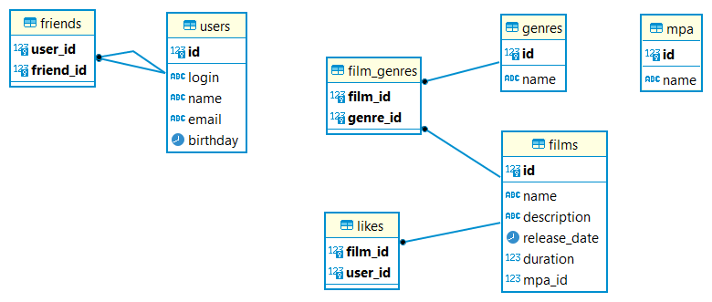

# Название проекта
Filmorate

# Описание проекта
Реализован бэкенд для работы с фильмами. Используются следующие сущности: пользователь, фильм, жанр, MPA. Для них реализованы стандартные операции CRUD. Имеются также дополнительные возможности.
- *Друзья пользователя.* Можно добавлять пользователю друзей, выводить списки друзей конкретного пользователя и общих друзей.
- *Лайки фильмам*. Пользователи могут ставить лайки фильмам и удалять их. Можно также выводить все лайки конкретного фильма.
- *Рейтинг фильмов*. Можно выводить список фильмов с максимальным рейтингом.

Проект реализован на основе **SpringBoot**, для доступа к данным используется **JDBC**. Данные организованы в соответствии со схемой:

#Развертывание и системные требования
*Версия Java*: 11. 

*Используются*: стартеры SpringBoot, встроенная база данных H2, библиотека lombok. 

*Развертывание*: собрать проект и вызвать метод **main** класса **FilmorateApplication**. По умолчанию приложение будет развернуто по адресу *localhost*:8080, а данные будут храниться во встроенной базе H2. Эти настройки можно изменить в файле **application.properties**. 

#Развитие проекта
- Бизнес-логика была существенно доработана в рамках группового проекта. Он доступен по адресу:
 [main](https://github.com/AltairPhinArev/java-filmorate/tree/main "")
- Был проведен рефакторинг проекта: добавлена (в формате обратной совместимости) возможность вместо лайков ставить оценки фильмам. Реализация этой возможности доступна по адресу:
 [add-marks](https://github.com/AltairPhinArev/java-filmorate/tree/add-marks "") 